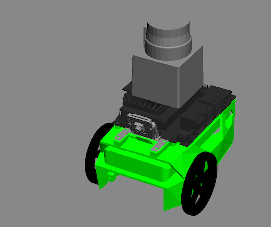
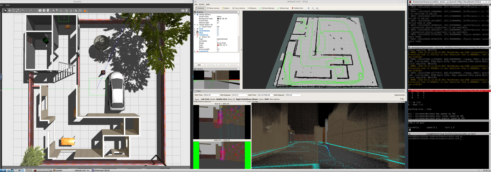
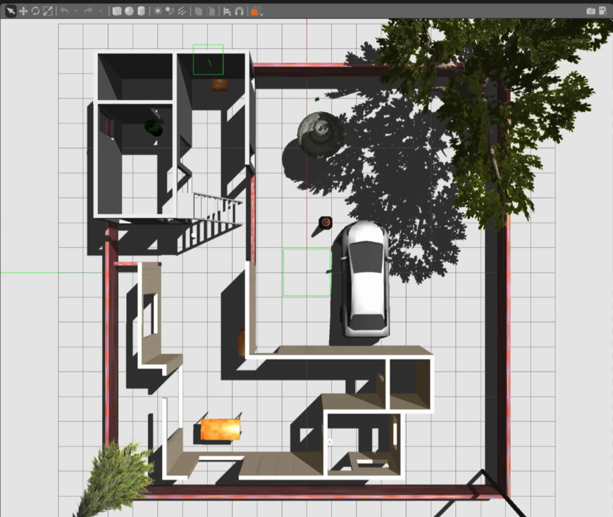
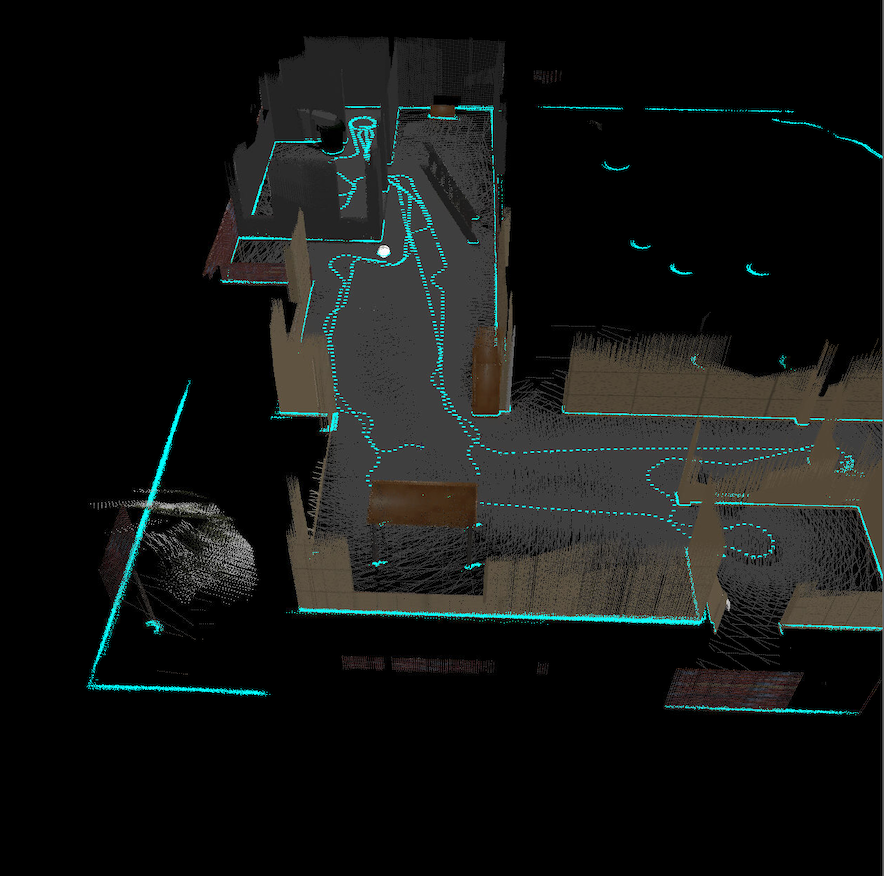
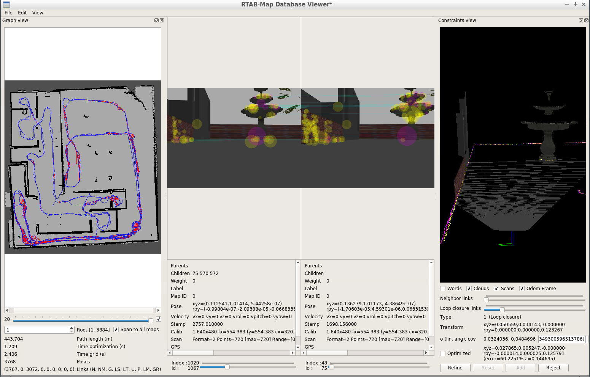

# RoboND-Robot-Map-My-World

Project 4 of Udacity Robotics Software Engineer Nanodegree Program [Video Clip](https://youtu.be/u6Ax9PQRKWU)


[](https://youtu.be/u6Ax9PQRKWU)

## Overview  
In the Map My World project, the 2D occupancy grid, and 3D octomap are created in a simulated environment using Jetbot (mobile robot) with the RTAB-Map package.
RTAB-Map (Real-Time Appearance-Based Mapping) is a popular solution for SLAM to develop robots that can map environments in 3D. RTAB-Map has good speed and memory management, and it provides custom developed tools for information analysis. 
However, Jetbot model is very small can be driven **maximum at 0.l speed**.</br></br>
  

 

## Prerequisites/Dependencies  
* Gazebo >= 7.0  
* ROS Kinetic  
* ROS rtabmap_ros package  
```
sudo apt-get install ros-kinetic-rtabmap-ros
```

* ROS gazebo package  
```
sudo apt-get install ros-kinetic-gazebo-ros-pkgs ros-kinetic-gazebo-ros-control  ros-kinetic-effort-controllers
```

## Run the project  
* Clone ros-teleop repository
* Clone this repository
* Open the repository and make  
```
cd /home/catkin_ws/src
git clone https://github.com/ros-teleop/teleop_twist_keyboard
cd ..
catkin_make
```

* Launch my_robot in Gazebo to load both the world and plugins  
```
cd /home/workspace/catkin_ws/
source devel/setup.bash
roslaunch my_robot world.launch
```  
 

* Launch RTAB-Map package  

Option 1: Delete database when launch startup.
```
cd /home/workspace/catkin_ws/
source devel/setup.bash
roslaunch my_robot mapping.launch
```  
Option 2: Not delete database when launch startup.
```
cd /home/workspace/catkin_ws/
source devel/setup.bash
roslaunch my_robot localization.launch
```  

* Launch ROS Teleop Twist Keyboard</br>
**IMPORTANT!!! Jetbot model is very very small must keep speed not more than 0.1 otherwise it will be CRASHED**
```
cd /home/workspace/catkin_ws/
source devel/setup.bash
roslaunch my_robot teleop.launch
```  
### Creating the map
Navigate robot Gazebo simulation with the Teleop terminal start by lower velocity. The goal is to get three-loop closures that will be sufficient for mapping the entire environment. </br> 

 


### Visualizing RTABMAP data
Opening sample mapping database:
Download the database from the my_robot to the local computer. [Link to download rtabmap.db](https://drive.google.com/file/d/1HBgunBDnrNIp43hBmqN_BkfCzBKsvfCo/view?usp=sharing)
```
cp ./rtabmap.db ~/catkin_ws/src/my_robot/database/
rtabmap-databaseViewer ~/catkin_ws/src/my_robot/database/rtabmap.db
```  
Once open, we will need to add some windows to get a better view of the relevant information, so:
* Say yes to using the database parameters
* View -> Constraint View
* View -> Graph View


On the left is the 2D grid map in all of its updated iterations and the robot's path. In the middle, there are different images from the mapping process that can step through images to see all of the features from your detection algorithm. These features are in yellow, and the pink indicates where two images have features in common, and this information is being used to create neighboring links and loop closures.

The number of loop closures in the bottom left of Graph view. The codes (N, NM, G, LS, LT, U, P) stand for the following: Neighbor, Neighbor Merged, Global Loop closure, Local loop closure by space, Local loop closure by time, User loop closure, and Prior link. This image shows that **the Global Loop Closures is 3072 loop closures**. This tool can be a useful resource for checking if the environment is feature-rich enough to make global loop closures. The right environment has many features that can be associated in order to achieve loop closures.

