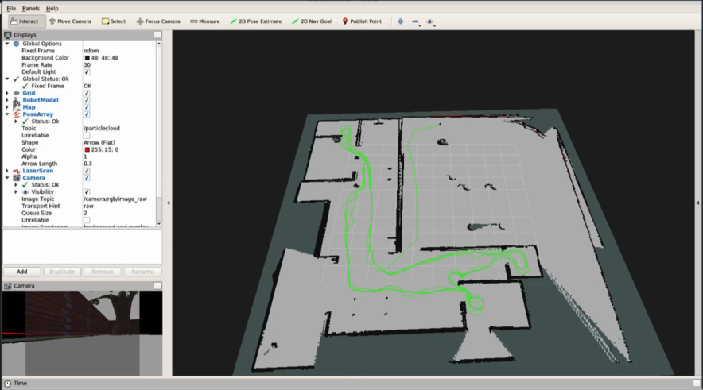
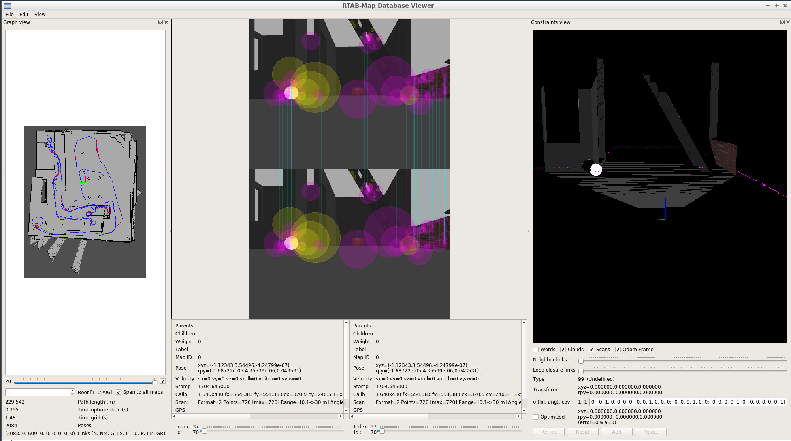
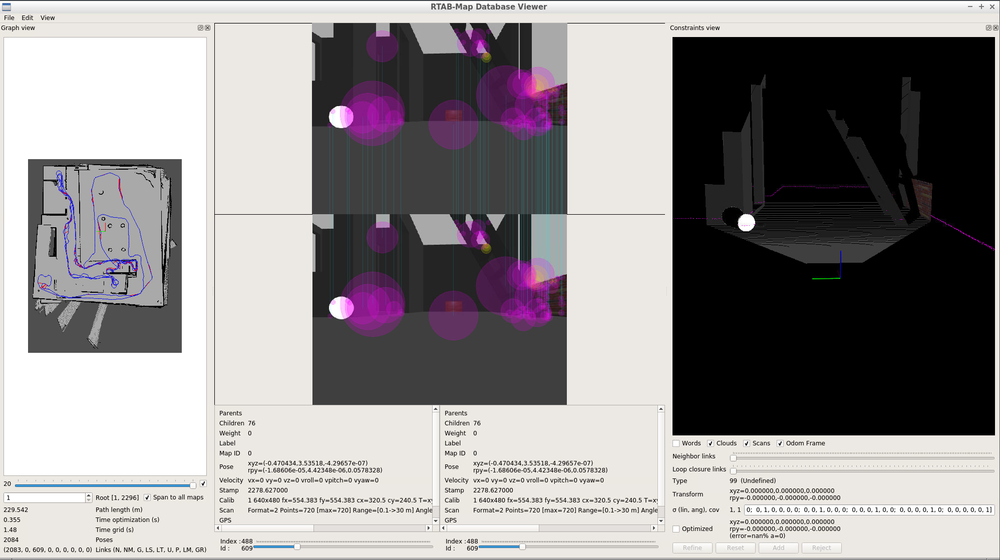

# RoboND-Robot-Map-My-World

Project 4 of Udacity Robotics Software Engineer Nanodegree Program [Video Clip](https://youtu.be/u6Ax9PQRKWU)


[](https://youtu.be/u6Ax9PQRKWU)

## Overview  
In the Map My World project, the 2D occupancy grid, and 3D octomap are created in a simulated environment using Jetbot (mobile robot) with the RTAB-Map package.
RTAB-Map (Real-Time Appearance-Based Mapping) is a popular solution for SLAM to develop robots that can map environments in 3D. RTAB-Map has good speed and memory management, and it provides custom developed tools for information analysis. 
However, Jetbot model is very small can be driven **maximum at 0.l speed**.</br></br>
  

 

## Prerequisites/Dependencies  
* Gazebo >= 7.0  
* ROS Kinetic  
* ROS rtabmap_ros package  
```
sudo apt-get install ros-kinetic-rtabmap-ros
```

* ROS gazebo package  
```
sudo apt-get install ros-kinetic-gazebo-ros-pkgs ros-kinetic-gazebo-ros-control  ros-kinetic-effort-controllers
```

## Run the project  
* Clone ros-teleop repository
* Clone this repository
* Open the repository and make  
```
cd /home/catkin_ws/src
git clone https://github.com/ros-teleop/teleop_twist_keyboard
cd ..
catkin_make
```

* Launch my_robot in Gazebo to load both the world and plugins  
```
cd /home/workspace/catkin_ws/
source devel/setup.bash
roslaunch my_robot world.launch
```  
 

* Launch RTAB-Map package  

Option 1: delete database when launch startup.
```
cd /home/workspace/catkin_ws/
source devel/setup.bash
roslaunch my_robot mapping.launch
```  
Option 2: Not delete database when launch startup.
```
cd /home/workspace/catkin_ws/
source devel/setup.bash
roslaunch my_robot localization.launch
```  

**IMPORTANT!!! Jetbot model is very very small must keep speed not more than 0.1 otherwise it will be CRASHED**
* Launch ROS Teleop Twist Keyboard 
```
cd /home/workspace/catkin_ws/
source devel/setup.bash
roslaunch my_robot teleop.launch
```  
### Mapping
1) The robot's simulated environment in Gazebo is the same as in the previous project:
![alt text][image1]
2) After manually driving the robot through the environment we can visualize the map (2D occupancy grid) of the environment and even the robot's path:
![alt text][image4]
3) In the visualizer tool of RTAB-Map we can see the RGBD pointcloud of the environment:
 


### Evaluating the RTAB-Map database
After a successful mapping we can evaluate the database with RTAB-Map's database viewer, that can be started with the following command:

`rtabmap-databaseViewer ~/catkin_ws/src/Udacity-Robotics-SLAM/my_robot/database/rtabmap.db`



[rtabmap.db](https://drive.google.com/file/d/1GiLPXxCMNAwcNP0wBklw8C7O_VvoNSE4/view?usp=sharing)
